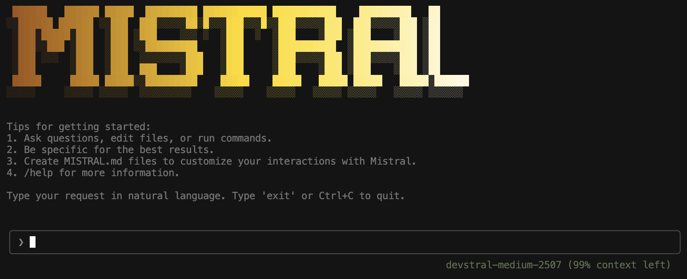

# Mistral CLI

A conversational AI terminal assistant powered by Mistral AI's Devstral models.



## Installation

```bash
git clone https://github.com/garciamathias/mistral-cli.git
cd mistral-cli
npm install
npm run build
npm link
```

## Configuration

Set your Mistral API key using one of these methods:

Environment variable:
```bash
export MISTRAL_API_KEY=your_api_key_here
```

Or create a `.env` file:
```
MISTRAL_API_KEY=your_api_key_here
LINKUP_API_KEY=your_api_key_here  # Optional for web search
```

## Usage

Start the CLI:
```bash
mistral
```

Specify a working directory:
```bash
mistral -d /path/to/project
```

## Examples

```
"Show me what's in the src folder"
"Create a new file called config.js"
"Find all TODO comments in the codebase"
"Run npm test"
"Search the web for Node.js best practices"
```

## Features

- Natural language interface for terminal operations
- File creation, editing, and management
- Command execution through conversation
- Web search integration
- Context-aware responses
- Multi-model support (Devstral Medium, Small)

## Custom Instructions

Create `.mistral/MISTRAL.md` in your project to customize behavior:

```markdown
# Project Instructions

- Use TypeScript for all files
- Follow ESLint rules
- Write unit tests
- Use functional programming patterns
```

## Development

```bash
npm run dev        # Development mode
npm run build      # Build project
npm run lint       # Run linter
npm run typecheck  # Type checking
```

## Requirements

- Node.js 16 or higher
- Mistral API key from https://mistral.ai

## License

MIT